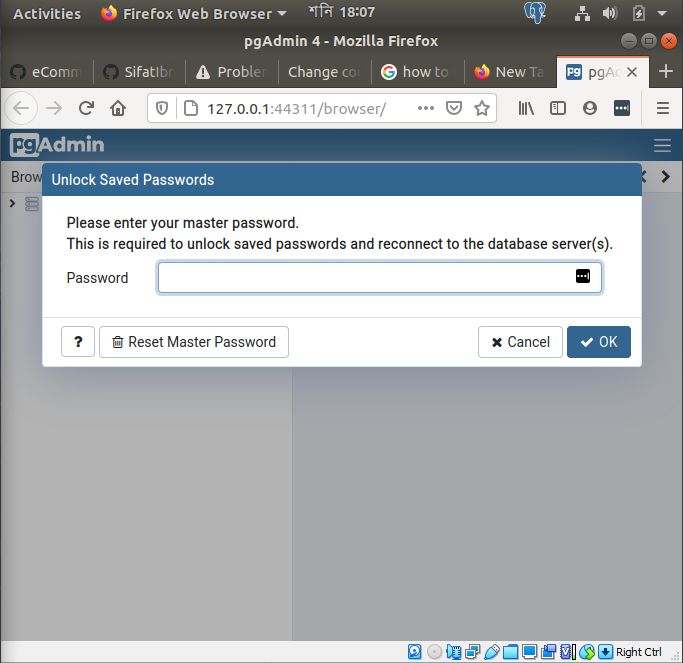

- [Postgre SQL](#postgre-sql)
- [Installation](#installation)
	- [Windows Installation](#windows-installation)
		- [Download Postgresql installer for windows](#download-postgresql-installer-for-windows)
	- [Linux installation](#linux-installation)
		- [Connect to the PostgreSQL database server via psql](#connect-to-the-postgresql-database-server-via-psql)
		- [Load the sample database](#load-the-sample-database)
		- [Setup the repository](#setup-the-repository)
		- [Install pgAdmin](#install-pgadmin)
- [SQL](#sql)
	- [Introduction](#introduction)
		- [What is SQL](#what-is-sql)
		- [SQL Statements](#sql-statements)
		- [SQL SCHEMA](#sql-schema)
- [Retrieve Data from Database Tables](#retrieve-data-from-database-tables)
	- [Selecting Data Using Basic SELECT Statement](#selecting-data-using-basic-select-statement)
		- [Expressions instead of column names](#expressions-instead-of-column-names)
	- [SELECT Statement with WHERE clause](#select-statement-with-where-clause)
		- [Comparison operators](#comparison-operators)
		- [Range condition using BETWEEN operator](#range-condition-using-between-operator)
		- [Joining multiple conditions in WHERE clause](#joining-multiple-conditions-in-where-clause)
		- [Pattern matching in texts using LIKE operator](#pattern-matching-in-texts-using-like-operator)
		- [Sorting Rows in the Output](#sorting-rows-in-the-output)
	- [Single Row functions](#single-row-functions)
		- [Case conversion functions](#case-conversion-functions)
		- [Date function](#date-function)
	- [Aggregate Functions](#aggregate-functions)
		- [Use of WHERE clause in GROUP BY query](#use-of-where-clause-in-group-by-query)
		- [Use of ORDER BY clause in GROUP BY query](#use-of-order-by-clause-in-group-by-query)
		- [DISTINCT and HAVING in GROUP BY queries](#distinct-and-having-in-group-by-queries)
	- [Query Multiple Tables – Joins](#query-multiple-tables--joins)
		- [Joining two tables by USING clause](#joining-two-tables-by-using-clause)
		- [Joining two tables by ON clause](#joining-two-tables-by-on-clause)
		- [Iner Join](#iner-join)
		- [LEFT Join](#left-join)
		- [RIGHT Join](#right-join)
		- [FULL OUTER Join](#full-outer-join)
	- [Creating a Table](#creating-a-table)
	- [Data Manipulation Language (DML)](#data-manipulation-language-dml)
		- [INSERT](#insert)
		- [UPDATE](#update)
		- [DELETE](#delete)

<small><i><a href='http://ecotrust-canada.github.io/markdown-toc/'>Table of contents generated with markdown-toc</a></i></small>


# Postgre SQL 

PostgreSQL, also known as Postgres, is a free and open-source relational database management system emphasizing extensibility and SQL compliance. Here we will discuss how to install and use postgre sql in details.


# Installation
Postgresql is an open source RDBMS ( Relational Management System) , available for Windows, Mac, Linux distribution.


## Windows Installation

For windows installation you have to follow thress steps :
- Download PostgreSQL installer for Windows
- Install PostgreSQL
- Verify the installation


### Download Postgresql installer for windows

From Postgresql official page 32 bit and 64 bit installer is available. From there download the installer and the rest is pretty much easy follow.
- One or Two things you have to remember though.
If you follow the installation instruction , then after some step the installer will ask you to give passwords. Remember it's for default **superuser** named **postgres**.


- Next the installer ask you to set a port. The default port of PostgreSQL is 5432. You need to make sure that no other applications are using this port.
-  

To check if the installation is complete or not. Search for **psql** in windows search bar. If see a **SQL SHELL** , then the installation is complete.


Second, enter all the necessary information such as the server, database, port, username, and password. To accept the default, you can press **Enter**. Note that you should provide the password that you entered during installing the PostgreSQL.
```console
Server [localhost]: (leave it blank or enter localhost, then press Enter)
Database [postgres]: (leave it blank or enter postgres, then Press Enter)
Port [5432]: (leave it blank or enter 5432, then Press Enter)
Username [postgres]: (leave it blank or enter postgres, then Press Enter)
Password for user postgres: (Give your password)
psql (12.3) 
WARNING: Console code page (437) differs from Windows code page (1252) 
		 8-bit characters might not work correctly. See psql reference page 
		 "Notes for Windows users" for details. Type "help" for help. 
postgres=#
```

**Third**, issue the command `SELECT version();` you will see the following output:


## Linux installation

Linux installation is different than windows installation.Here's how can you install postgresql in Linux Distriution. I am using UBUNTU 18.04 . But the command lines are pretty much same for other distribution.

- Create the file repository configuration:
```console
sudo sh -c 'echo "deb http://apt.postgresql.org/pub/repos/apt $(lsb_release -cs)-pgdg main" > /etc/apt/sources.list.d/pgdg.list'
```
- Import the repository signing key:
```console
wget --quiet -O - https://www.postgresql.org/media/keys/ACCC4CF8.asc | sudo apt-key add -
```
-  Update the package lists:
```console
sudo apt-get update
```
- Install the latest version of PostgreSQL.If you want a specific version, use **postgresql-12** or similar instead of **postgresql** :
```console
sudo apt-get install postgresql
```
It will take few minutes to download and install the PostgreSQL.

###  Connect to the PostgreSQL database server via psql
In PostgreSQL, a user account is referred to as a  [role](https://www.postgresqltutorial.com/postgresql-roles/). By default, PostgreSQL uses  **ident** authentication.

It means that PostgreSQL will associate its roles with the system accounts of Linux. If a role exists in PostgreSQL, the same Linux user account with the same name is able to log in as that role.

When you installed PostgreSQL, the installation process created a user account called  `postgres`  associated with the default  `postgres`  role.

To connect to PostgreSQL using the  `postgres`  role, you switch over to the  `postgres`  account on your server by typing:
```console
$ sudo -i -u postgres
```
It’ll prompt for the password of the current user. You need to provide the password and hit the  `Enter`  keyboard.

Then, you can access the PostgreSQL using the  `psql`  by typing the following command:
```console
$ psql
```
You’ll access the **postgres** prompt like this:
```console
postgres=#
```
From here, you can interact with the PostgreSQL like issuing a query.

To quit the PostgreSQL prompt, you run the following command:

```console
postgres=# \q
```
This above command will bring you back to the **postgres** Linux command prompt.
```console
postgres@ubuntu-dev:~$
```
To return to your regular system user, you execute the `exit` command like this:

```console
postgres@ubuntu-dev:~$ exit
```

### Load the sample database

To load the sample database into the PostgreSQL database server, you follow these steps:

**First**, switch over the postgres account using the following command:
```console
$ sudo -i -u postgres
```
It’ll prompt you for the password of the current user.Remeber it's your ubuntu user account password as you are using terminal as a superuser , **sudo** . You need to type the password of the current user and press the `Enter` keyboard.

**Second**, download the sample database using the `curl` tool:
```console
$ curl -O https://sp.postgresqltutorial.com/wp-content/uploads/2019/05/dvdrental.zip
```
**Third**, unzip the dvdrental.zip file to get the dvdrental.tar file:
```console
$ unzip dvdrental.zip
```
The output will show like this :
```console
Archive:  dvdrental.zip
inflating: dvdrental.tar
```
**Fourth**, access the PostgreSQL using the `psql` tool:
```console
$ psql
```
Fifth, create the `dvdrental` database using the `CREATE DATABASE` statement:
```console
postgres=# create database dvdrental;
```
**DON'T FORGET THE SEMICOLON**
The output will show something like this :
```console
CREATE DATABASE
```
**Seventh**, use the [`pg_restore`  tool to restore](https://www.postgresqltutorial.com/postgresql-restore-database/) the `dvdrental` database:
```console
$ pg_restore --dbname=dvdrental --verbose dvdrental.tar
```
**Eighth**, access PostgreSQL database server again using `psql`:

```console
$ psql
```

**Ninth**, switch to the `dvdental` database:

```console
postgres=# \c dvdrental
```

Now, you’re connected to the `dvdrental` database:

```console
dvdrental=#
```

**Finally**, enter the following command to get the number of films in the `film` table:

```console
dvdrental=# select count(*) from film;
```

**Don't Forget the semicolon**
Here is the output:

```console
count 
------- 
1000
(1 row)
```

So this is how you can create and connect to database

There's a tool available for managing postgresql, called **pgadmin** , by which anyone can create a`nd load database  and run any query command easily. It may be run either as a web or desktop application. Now i will show how to install pgadmin 4 on your desktop.

The good news is in windows distribution pgadmin 4 comes with the installer, i mean when you installed postgre sql for windows , the installer took care of everything for you.

But in Linux Distribution you have to install it externally , or what i'm trying to say is , you have to install it using terminal.
Here's is few steps to install pgadmin 4:

### Setup the repository

- Install the public key for the repository (if not done previously):

```console
curl https://www.pgadmin.org/static/packages_pgadmin_org.pub | sudo apt-key add
```

- Create the repository configuration file:

```console
sudo sh -c 'echo "deb https://ftp.postgresql.org/pub/pgadmin/pgadmin4/apt/$(lsb_release -cs) pgadmin4 main" > /etc/apt/sources.list.d/pgadmin4.list && apt update'
```

### Install pgAdmin

- Install for both desktop and web modes:
  
```console
sudo apt install pgadmin4
```

- Install for desktop mode only:
  
```console
sudo apt install pgadmin4-desktop
```

- Install for web mode only:
  
```console
sudo apt install pgadmin4-web
```

- Configure the webserver, if you installed
- pgadmin4-web:
  
```console
sudo /usr/pgadmin4/bin/setup-web.sh
```

Now if you search in your desktop writing `pgadmin4`, you should find it. After clicking a window should open in your web browser.


# SQL

## Introduction

### What is SQL

Structured Query Language (SQL) is the language used to interaction with a database management
system. The language defines the statements for retrieving data from the database, updating data in the
database, inserting data into the database, and more similar things.
SQL is the way by which all programs and users access data in an Oracle database. SQL provides
statements for a variety of tasks including:

- Querying data
- Inserting, updating, and deleting rows in a table
- Creating, replacing, altering, and dropping objects
- Controlling access to the database, and its objects
- Guaranteeing database consistency and integrity

### SQL Statements

SQL statement are bunch of lines to retrieve our desired data from the database. Here's some bunch of SQL Statements that are frequently used

|  SQL statement  |  |Function of the statement  |
|---|---| --- |
|  SELECT |  |Retrieves data from database |
|  INSERT , UPDATE, DELETE|   | Inserts data, updates data, and deletes data in database |
| CREATE , ALTER, DROP  |   | Creates new tables in database, alters existing tables, deletes tables from database |

### SQL SCHEMA

 Schema in SQL is a collection of database objects associated with a database. I've loaded dvdrental database in the previous discussion. In this database it contains a schema with bunch of tables.

 
 __*DataGrip*

 I am using a free software provided by Jetbrains named DataGrip. However if you want to use pgadmin or other tools it should work fine.

 And each table has bunch of columns with pk (primary key) and fk (foreign key).

However in this section i'll be using different schema called HR schema. You can also load the schemas according to the previous database loading section. The HR schema contains bunch of schema like dvdrental database's schema. Here are the tables it contains :


The following table shows the column names for all tables in HR schema.

| Table Name | Column Names |
| --- | --- |
|REGIONS|REGION_ID, REGION_NAME|
|COUNTRIES|COUNTRY_ID, COUNTRY_NAME, REGION_ID|
|LOCATIONS|LOCATION_ID, STREET_ADDRESS, POSTAL_CODE, CITY,STATE_PROVINCE, COUNTRY_ID|
|DEPARTMENTS |DEPARTMENT_ID, DEPARTMENT_NAME, MANAGER_ID,LOCATION_ID|
|EMPLOYEES|EMPLOYEE_ID, FIRST_NAME, LAST_NAME, EMAIL,PHONE_NUMBER,HIRE_DATE, JOB_ID, SALARY,COMMISSION_PCT, MANAGER_ID, DEPARTMENT_ID|
|JOB_HISTORY|EMPLOYEE_ID, START_DATE, END_DATE, JOB_ID,DEPARTMENT_ID|
|JOBS|JOB_ID, JOB_TITLE, MIN_SALARY, MAX_SALARY|

# Retrieve Data from Database Tables

## Selecting Data Using Basic SELECT Statement

If we want to select all the data from  the Employees table. we write 

```console
SELECT * FROM EMPLOYEES ;
```

The output is like this.


as we can see the query returning whole table with all columns.

### Expressions instead of column names

You can also use expressions instead of direct column names in the SELECT clause as shown below. The
query will multiply values of SALARY column by 12, and then will display the results.

```console
SELECT EMPLOYEE_ID, LAST_NAME, SALARY*12
FROM EMPLOYEES ;
```

You can use arithmetic expressions involving addition, subtraction, multiplication, and division as shown
in following SELECT statements

```console
SELECT EMPLOYEE_ID, LAST_NAME, SALARY*12
FROM EMPLOYEES ;
SELECT EMPLOYEE_ID, LAST_NAME, SALARY+12
FROM EMPLOYEES ;
SELECT EMPLOYEE_ID, LAST_NAME, (SALARY-1000)*5
FROM EMPLOYEES ;
SELECT EMPLOYEE_ID, LAST_NAME, (SALARY + SALARY*0.15) / 1000
FROM EMPLOYEES ;
```

## SELECT Statement with WHERE clause

with where claus you can specifically ask for a sigle row or a columns.
For example, the following SELECT retrieves last names and salaries of those employees only whose
DEPARTMENT_ID column value is 80.

```console
SELECT LAST_NAME, SALARY
FROM EMPLOYEES
WHERE DEPARTMENT_ID = 80 ;
```

### Comparison operators

The condition in the above WHERE clause uses the equal (‘=’) operator to compare DEPARTMENT_ID values. The most commonly used comparison operators
are:

| Operator | Description |
| --- | --- |
|=|Equal to|
|>|Greater than|
|>=|Greater than or equal to|
|<|Less than|
|<=|Less than or Equal to|

### Range condition using BETWEEN operator

You can check whether a value is in the given range by using the BETWEEN operator. The following statements illustrate this.

```console
SELECT LAST_NAME, SALARY
FROM EMPLOYEES
WHERE SALARY BETWEEN 5000 AND 10000 ;
SELECT LAST_NAME, SALARY
FROM EMPLOYEES
WHERE HIRE_DATE BETWEEN '01-JAN-1990' AND '31-DEC-1995' ;
```

### Joining multiple conditions in WHERE clause

You can join two or more conditions using AND, OR, and NOT operators. You may need to use parenthesis to enforce operation execution order.
The following example shows the use of AND, OR and NOT operators.

```console
SELECT LAST_NAME, SALARY
FROM EMPLOYEES
WHERE DEPARTMENT_ID = 80 AND SALARY > 5000 ;
SELECT LAST_NAME, SALARY
FROM EMPLOYEES
WHERE JOB_ID = 'SALES_REP' OR SALARY >= 10000 ;
SELECT LAST_NAME, SALARY
FROM EMPLOYEES
WHERE COMMISSION_PCT IS NOT NULL ;
```

### Pattern matching in texts using LIKE operator

The LIKE operator is used for pattern matching in texts. Suppose, you want to retrieve those employee records whose last names contain the character, ‘s’. This type of condition is expressed using LIKE operators and two special symbols (‘%’ and ‘_’). For example, the following statement will retrieve all retrieve records of those employees whose last name column contain at least one ‘s’.

```console
SELECT LAST_NAME, SALARY
FROM EMPLOYEES
WHERE LAST_NAME LIKE '%s%' ;
```

### Sorting Rows in the Output

You can use the ORDER BY clause with the SELECT statement to sort the rows in the results. The
general syntax is given below:

```console
SELECT …
FROM table_name
WHERE …
ORDER BY Column1 [ASC | DESC], Column2 [ASC | DESC], …
```

The ORDER BY clause is used after the WHERE clause to specify sorting order. The following statement retrieves records of employees and sorts the output in descending order of SALARY values.

```console
SELECT LAST_NAME, SALARY
FROM EMPLOYEES
ORDER BY SALARY DESC ;
SELECT LAST_NAME, SALARY, HIRE_DATE
FROM EMPLOYEES
ORDER BY HIRE_DATE ASC ;
```

## Single Row functions

### Case conversion functions

The case conversion functions are used to convert case of text characters.The most used functions for this purpose 	are given below:

| Function | Description|
|---|---|
|LOWER (text)|Converts the text to all lowercase. Here, text can be column name or an expression.|
|UPPER (text)|Converts the text to all uppercase. Here, text can be column name or an expression|
|INITCAP (text)|Converts the first character of the text to uppercase. Here, text can be column name or an expression.|

The following statement shows the use case-conversion functions in SELECT statements.

```console
SELECT (INITCAP(FIRST_NAME) || LOWER(LAST_NAME)) NAME, UPPER(JOB_ID) JOB
FROM EMPLOYEES ;
```

Case conversion functions are frequently used in WHERE clause to match specific texts. For example, if
you want to retrieve records of those departments which contain the text SALE in its name, then you may
write the following statement.

```console
SELECT *
FROM DEPARTMENTS
WHERE UPPER(DEPARTMENT_NAME) LIKE '%SALE%' ;
SELECT *
FROM DEPARTMENTS
WHERE LOWER(DEPARTMENT_NAME) LIKE '%sale%' ;
```

### Date function

Get the current time

```console
SELECT NOW();
```

Get current time

```console
SELECT NOW()::TIME;
```
Get current date

```console
SELECT NOW()::DATE;

```

**calcuating dates**
Subtracting date

```console
SELECT NOW() - INTERVAL '10 YEARS'; # should return the date from 10 years ago.
```
Adding days
```console
SELECT NOW() + INTERVAL '10 MONTHS'; # should return the date after 10 months.
```

**extracting data.**

Extracting can be done by the EXTRACT function.

```console
SELECT EXTRACT(DAY FROM NOW());
```

## Aggregate Functions

In previous chapter, we have studied single-row functions. Those functions operates on one single row
and outputs something based on the input columns of the row. The group functions operate on a group of
rows and outputs a value such as total, average, etc. These functions report only summary information per
group, rather than per row.

The group functions result in only one row per group of rows in the output. The most commonly used
group functions are given below.

|Functions|Description|
|---|---|
SUM (Column)|Finds the total, i.e., summation of values in Column for all rows in the group|
|MAX(Column)|Finds the maximum value in Column for all rows in the group|
MIN(Column)|Finds the minimum value in Column for all rows in the group|
AVG(Column) |Finds the average value in Column for all rows in the group
COUNT(Column)|Count the number of non-NULL values in Column for all rows in the group

For example, suppose, you want to know the maximum salary, minimum salary and average salary the company pays in different job types. The following GROUP BY query will retrieve the required information.

```console
SELECT JOB_ID, MAX(SALARY), MIN(SALARY), AVG(SALARY)
FROM EMPLOYEES
GROUP BY JOB_ID ;
```

### Use of WHERE clause in GROUP BY query

In a GROUP BY statement, the WHERE clause can be used for filtering rows before grouping is applied.
The general syntax of such statements is given below.

```console
SELECT Column1, Column2, … , SUM(Column1), MAX(Column1), …
FROM table_name
WHERE condition
GROUP BY Column1, Column2, …
```

The following statement finds the maximum and minimum salary for each job types for only the
employees working in the department no. 80

```console
SELECT JOB_ID, MAX(SALARY), MIN(SALARY)
FROM EMPLOYEES
WHERE DEPARTMENT_ID = 80
GROUP BY JOB_ID ;
```

### Use of ORDER BY clause in GROUP BY query

In a GROUP BY statement, ORDER BY clause can be used to sort the final group results based on
grouping column. The following example sorts the final results based on JOB_ID value.

```console
SELECT JOB_ID, MAX(SALARY), MIN(SALARY)
FROM EMPLOYEES
WHERE DEPARTMENT_ID = 80
GROUP BY JOB_ID
ORDER BY JOB_ID ASC ;
```

### DISTINCT and HAVING in GROUP BY queries

You can use DISTINCT keyword inside the group functions as given below. In this case, group functions
consider only unique rows, and discards duplicate values. So, duplicate value is counted only once for
calculation.

```console
SELECT JOB_ID, MAX(DISTINCT SALARY), MIN(DISTINCT SALARY),
SUM(DISTINCT SALARY), COUNT(DISTINCT DEPARTMENT_ID)
FROM EMPLOYEES
WHERE DEPARTMENT_ID = 80
GROUP BY JOB_ID
ORDER BY JOB_ID ASC ;
```

You can use the HAVING clause to remove some group information from the final results. Suppose, you
want to retrieve the maximum and minimum salaries of each department except the department no. 80.
The following GROUP BY statement will retrieve the required information. The information for group
no. 80 are removed using a HAVING clause. HAVING works like WHERE except that HAVING works
on groups.

```console
SELECT DEPARTMENT_ID, MAX(SALARY), MIN(SALARY)
FROM EMPLOYEES
GROUP BY DEPARTMENT_ID
HAVING DEPARTMENT_ID <> 80 ;
```

## Query Multiple Tables – Joins

### Joining two tables by USING clause

The following example statement joins EMPLOYEES and DEPARTENT tables based on the values of
DEPARTMENT_ID column. A row from EMPLOYEES table is joined with a row from
DEPARTMENTS table where both rows have the same DEPARTMENT_ID value.

```console
SELECT E.LAST_NAME, D.DEPARTMENT_NAME
FROM EMPLOYEES E JOIN DEPARTMENTS D USING (DEPARTMENT_ID) ;
```

### Joining two tables by ON clause

Two tables can be joined using the ON clause which is more general than USING. The ON clause specifies an explicit condition on which rows will be joined together. In case of USING, rows are joined based on same values (an equality condition) in join column. But, in case of ON clause, the condition can be specified explicitly allowing equality and non-equality conditions for join. The following statement shows the same join as before but using ON clause.

```console
SELECT E.LAST_NAME, E.DEPARTMENT_ID, D.DEPARTMENT_NAME
FROM EMPLOYEES E JOIN DEPARTMENTS D
ON (E.DEPARTMENT_ID = D.DEPARTMENT_ID) ;
```

### Iner Join 

The INNER JOIN keyword selects records that have matching values in both tables.

```console
SELECT column_name(s)
FROM table1
INNER JOIN table2
ON table1.column_name = table2.column_name;
```


### LEFT Join

The SQL LEFT JOIN returns all rows from the left table, even if there are no matches in the right table. This means that if the ON clause matches 0 (zero) records in the right table; the join will still return a row in the result, but with NULL in each column from the right table.


```console
SELECT table1.column1, table2.column2...
FROM table1
LEFT JOIN table2
ON table1.common_field = table2.common_field;
```

### RIGHT Join

The RIGHT JOIN keyword returns all records from the right table (table2), and the matched records from the left table (table1). The result is NULL from the left side, when there is no match.


```console
SELECT column_name(s)
FROM table1
RIGHT JOIN table2
ON table1.column_name = table2.column_name;
```

### FULL OUTER Join

The FULL OUTER JOIN keyword returns all records when there is a match in left (table1) or right (table2) table records.

```console
SELECT column_name(s)
FROM table1
FULL OUTER JOIN table2
ON table1.column_name = table2.column_name
WHERE condition;
```


In a Nutshell :


## Creating a Table

This is how you can create a table :

```console
CREATE TABLE Persons (
    PersonID int,
    LastName varchar(255),
    FirstName varchar(255),
    Address varchar(255),
    City varchar(255)
);

```

The table looks like this:


##  Data Manipulation Language (DML)

DML statements are used to:

- Adding new rows to a table – INSERT statements
- Changing data in a table – UPDATE statements
- Removing rows from a table – DELETE statements


### INSERT

The INSERT INTO statement is used to insert new records in a table.

```console
INSERT INTO table_name (column1, column2, column3, ...)
VALUES (value1, value2, value3, ...);
```

If you are adding values for all the columns of the table, you do not need to specify the column names in the SQL query. However, make sure the order of the values is in the same order as the columns in the table. The INSERT INTO syntax would be as follows

```console
INSERT INTO table_name
VALUES (value1, value2, value3, ...);
```
After writing this query


I got 


### UPDATE

The UPDATE statement is used to modify the existing records in a table.

```console
UPDATE table_name
SET column1 = value1, column2 = value2, ...
WHERE condition;
```

After this query:


The result is :


### DELETE

The DELETE statement is used to delete existing records in a table.

```console
DELETE FROM table_name WHERE condition;
```

In this following query i'm trying to delete a person with personid 12.


As the table had only one row, the output should be an empty table.


As expected.
